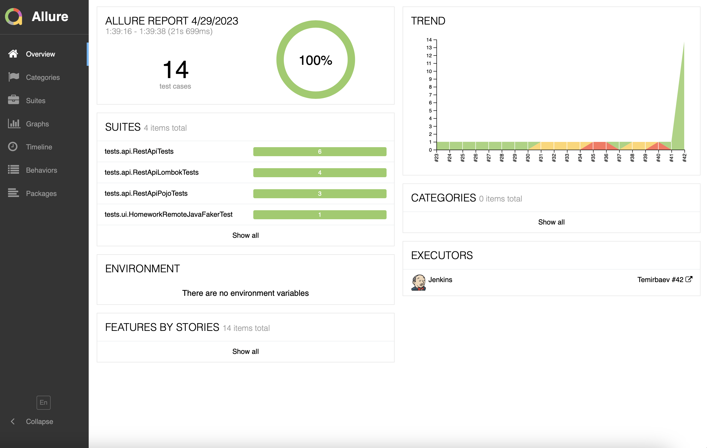
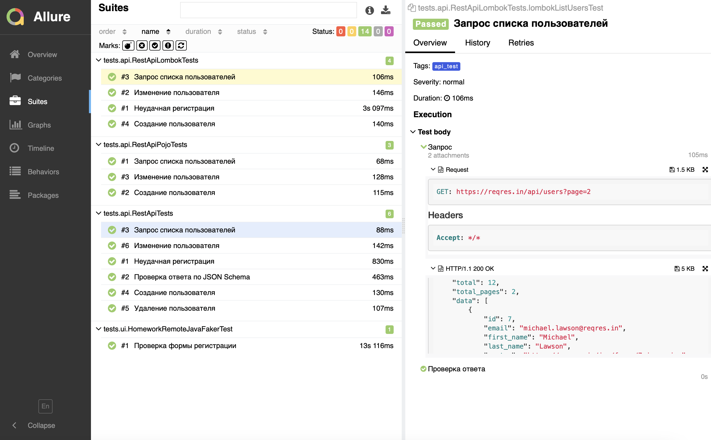
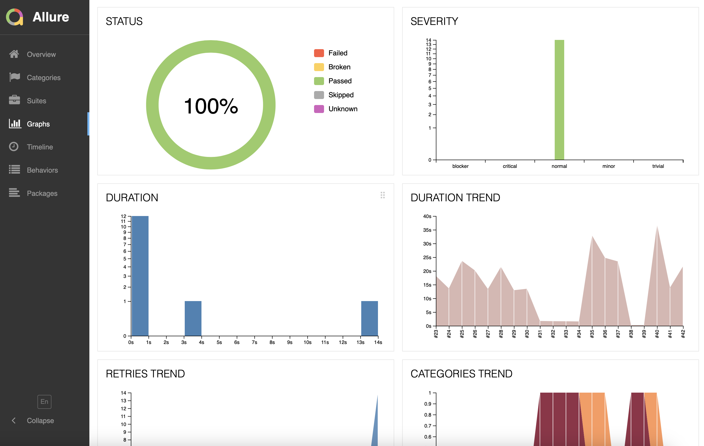
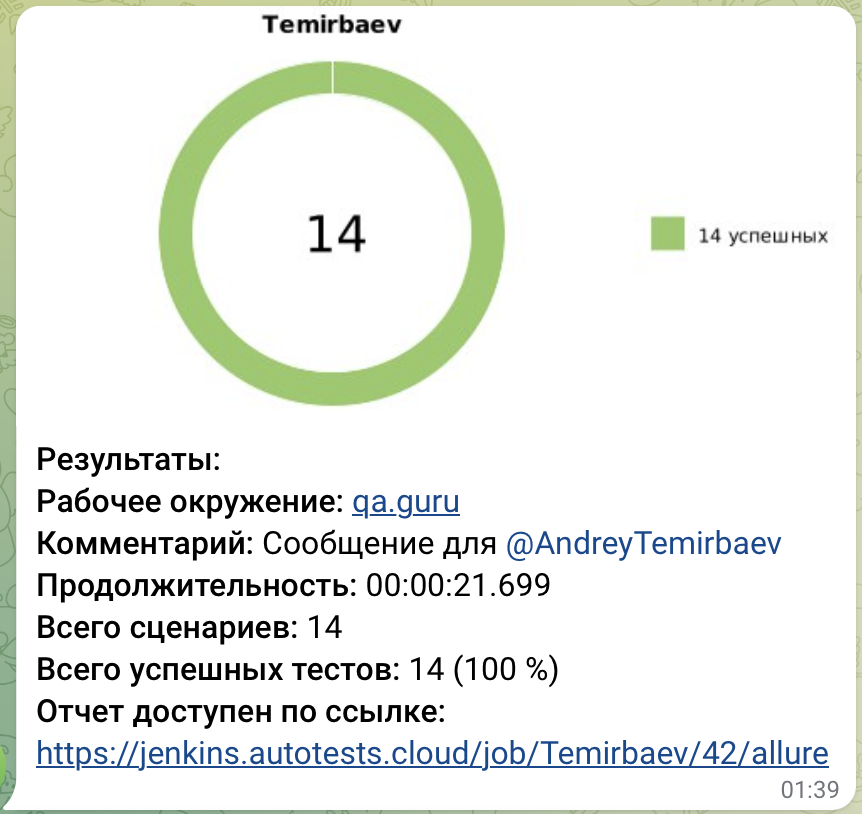

<h1 >Проект автоматизации тестирования</h1>

## Содержание
* <a href="#annotation">Описание</a>
* <a href="#tools">Технологии и инструменты</a>
* <a href="#cases">Реализованные проверки</a>
* <a href="#console">Запуск тестов из терминала</a>
* <a href="#jenkins">Запуск тестов в Jenkins</a>
* <a href="#allure">Отчеты в Allure</a>
* <a href="#telegram">Уведомления в Telegram с использованием бота</a>

<a id="annotation"></a>
## Описание
Тестовый проект состоит из веб-тестов (UI) и тестов API.\
Краткий список интересных фактов о проекте:
- [x] `Page Object` проектирование
- [x] Возможность локального и удалённого запуска тестов
- [x] Возможность запуска как всех тестов, так и отдельно WEB, API
- [x] Использование `Faker` для генерации данных
- [x] Использование `Lombok` и `Pojo` для моделей в API тестах
- [x] Использование request/response спецификаций для API тестов
- [x] Custom Allure listener для API requests/responses логов
- [x] Автотесты оформлены как тестовая документация посредством аннотаций `Allure`

Автотесты в этом проекте написаны на Java с использованием фреймворка [Selenide](https://selenide.org/) \
<code>Gradle</code> — используется как инструмент автоматизации сборки. \
<code>JUnit5</code> — для выполнения тестов. \
<code>Selenoid</code> — для удаленного запуска браузера в Docker контейнерах. \
<code>REST Assured</code> — для тестирования REST-API сервисов. \
<code>Jenkins</code> — CI/CD для запуска тестов удаленно. \
<code>Allure Report</code> — для визуализации результатов тестирования.\
<code>Telegram Bot</code> — для уведомлений о результатах тестирования.

Allure-отчет включает в себя:
* шаги выполнения тестов;
* скриншот страницы в браузере в момент окончания автотеста;
* Page Source;
* логи браузерной консоли;
* видео выполнения автотеста.

<a id="cases"></a>
## Реализованные проверки

### Автоматизированные проверки WEB
:heavy_check_mark: Проверка заполнения всех полей на странице

:heavy_check_mark: Проверка результатов заполнения

### Автоматизированные проверки API
:heavy_check_mark: Проверка запроса списка пользователей

:heavy_check_mark: Проверка создания пользователя

:heavy_check_mark: Проверка изменения пользователя

:heavy_check_mark: Проверка неудачной регистрации

##  Запуск тестов из терминала
### Локальный запуск тестов
#### WEB
./gradlew clean java_faker
#### API
./gradlew clean api_test

### Удаленный запуск тестов

```
clean
java_faker_remote
api_test
-Dbrowser=${browser}
-DbrowserVersion=${browserVersion}
-DbrowserSize=${browserSize}
-DbaseUrlSelenoid=${baseUrlSelenoid}
```

<a id="jenkins"></a>
## Запуск тестов в <a target="_blank" href="https://jenkins.autotests.cloud/job/Temirbaev/"> Jenkins </a>

> Сборка с параметрами позволяет перед запуском изменить параметры для сборки (путем выбора из списка или прямым указанием значения).


https://jenkins.autotests.cloud/job/Temirbaev/42/

<a id="allure"></a>
## Отчеты в <a target="_blank" href="https://jenkins.autotests.cloud/job/Temirbaev/42/allure/"> Allure report </a>

### Основное окно

<p align="center">

</p>

### Тесты

<p align="center">

</p>

### Графики

<p align="center">

</p>

<a id="telegram"></a>
## Уведомления в Telegram с использованием бота

<p>

</p>


